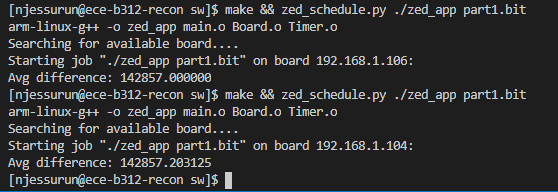

# Lab 5 - Cross-Domain Clock Signals

_Lab members: Nathan Jessurun, Tanjid Rahman_

## Part 1

The provided code initially would not run without timing errors, as noted in the included screenshot:



However, after adding a simple dual-flop synchronizer to the pulse train, this issue was resolved.

## Part 2

The provided code for part 2 never gave us any timing errors. I.e. there was an average error of `0` even without any changes to the handshake files. However, a closer look at `handshake.vhd` showed the `send_s` and `ack_s` signals are only asserted for 1 cycle in the provided code. So, we added the following lines in the appropriate states:

```vhdl
when S_WAIT_FOR_ACK =>
    send_s <= '1'; -- We added this line
    if (ack_s = '1') then
        send_s <= '0';
    state_src <= S_RESET_ACK;
    end if;
        
-- ...
when S_RESET_ACK =>
    ack_s <= '1'; -- We added this line
    if (send_s = '0') then
        ack_s      <= '0';
    state_dest <= S_READY;
    end if;
```

This way, the `send` and `ack` signals are asserted indefinitely until the control logic dictates it is time to de-assert them.


## Part 3

Per lab instructions, we added IP cores for both the 32-bit input and 17-bit output FIFOs. After minor modification to the `user_app` vhdl file, the code synthesized and ran with no errors in software.